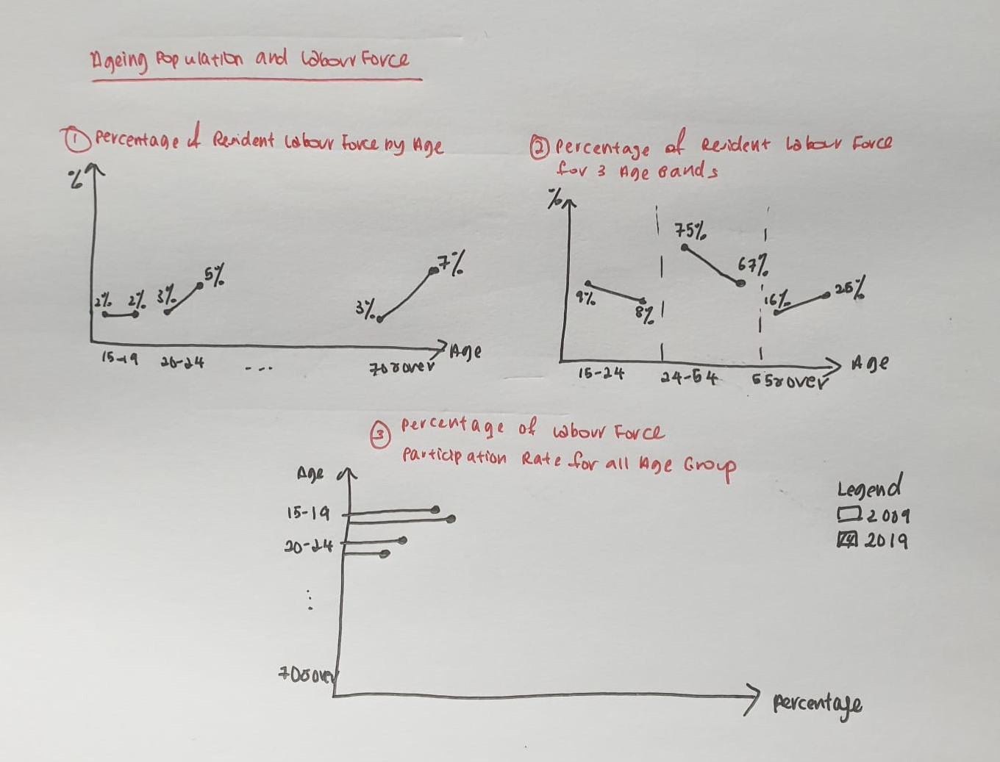
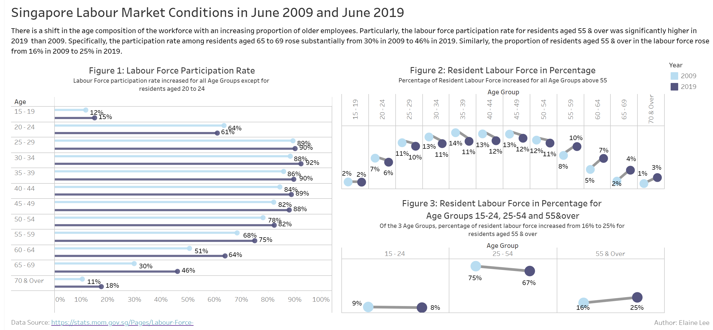

```{r setup, include=FALSE}
knitr::opts_chunk$set(echo = FALSE)
```

#  1.0 Critic the Graph from both its clarity and aesthetics. At least three from each evaluation criterion.

The Report on Labour Force in Singapore is a key annual report on Singapore’s labour market.    

Below is the extract of chart obtained from the Report: Labour Force in Singapore 2019.


**Clarity**:    

1. The chart title indicates “Resident labour force by age” but does not explain if it is showing counts or percentages on the line chart. There are no label added to the data points as well, hence hindering the proper interpretation of data. 

2. The lead-in paragraph explained the relationship between Resident Labour Force for different age group and Labour Force Participation Rate (LFPR).    
However, there is no separate visuals created in the chart that depicts LFPR.   
Hence, nable to clearly identify the correlation between Resident Labour Force and LFPR.

3. The lead-in paragraph explained the increment of median age of residents in the labour force.    
However, the median age is simply an indication on the chart and does not provide any meaning to the interpretation of the chart. Also, the source of the data for median age is not provided.

4. The lead-in paragraph compared the increment of Resident Labour Force aged 55 and over and decline of Resident Labour Force aged 25 to 54.    
However, the chart depicts the time series data; in this case, a 5-year age bands were used.   
Hence, there is no standardization of age bands as explained in both lead-in paragraph and chart, and this may hinder the proper interpretation of data. 

**Aesthetics**:   

1. There is no vertical axis in the chart. Hence, unable to clearly understand what the data is about.    

2. There is no axis title for both horizontal and vertical axis. Hence unable to clearly understand what the data is about. 

3. Data Labels (for example, percentage of Resident Labour Force) are not displaying for all the data points on the line chart. Rather, it is displayed in a table format below the chart.  Hence, unable to facilitate easy reading of data points.

4. There are clear direct labels on the line charts indicating June 2009 and June 2019.

5. The use of 2 different colours is to visually identify the trend for two years, 2009 and 2019. No overuse of colour as Blue and Grey fits well together.

6. There is clear indication of data source stated in the chart.

#  2.0 With reference to the critics above, suggest alternative graphical presentation to improve current design. The proposed alternative data visualization must be in static form. Sketch out the proposed design. Support your design by describing the advantages or which part of the issue(s) your alternative design try to overcome.

**Clarity**:   

1. To modify the chart title to “Resident Labour Force in Percentage” to clearly reflect that the data presented is in percentage.

2. To add another bar graph to show the percentage of Labour Force Participation Rate (LFPR).   
This allows user to identify the relationship between LFPR and Resident Labour Force for different age group. 

3. To remove median age from the chart as it does not serve any meaningful interpretation to the data.

4. To create 3 distinct Age Groups (for example, Age Groups between 0 to 24, 25 to 54 and 55 & over) for comparing characteristics across time period.

**Aesthetics**:    

1. To show the vertical axis (in percentage) on the line chart.

2. To add axis titles to horizontal (i.e. Age Group) and vertical axes (i.e. Percentage of Resident Labour Force).

3. To display the data points in percentage for all values in the line chart.

4. Continue to add legends in the chart.

5. Continue to use contrasting colours for differentiation between time period.

6. Continue to include data source in the chart.

**Sketch of Proposed Design**:



1. In order to clearly compare the changes of Labour Force Participation Rate and Resident Labour Force for 2-year period across all age groups, 3 individual charts are proposed instead of 1 chart as shown in the initial visualization.

2. All charts are clearly displayed with relevant chart title, axis labels, mark labels and legend to provide user with visual clues to better understand and interpret the data.

3. All age groups are classified into 3 distinct age groups (15-24, 25-54, 55&above) so that user can directly relate to the information described in the lead-in paragraph.

#  3.0 Using Tableau, design the proposed data visualization.

Data Visualization can be found in Tableau Public Server:     https://public.tableau.com/profile/elaine3214#!/vizhome/Book4_16118304881740/Dashboard

#  4.0 Provide step-by-step description on how the data visualization was prepared.

## Data Sources
Data Sources are extracted from https://stats.mom.gov.sg/Pages/Labour-Force-Tables2019.aspx

Table 5: Resident Labour Force Participation Rate by Age and Sex, 2009-2019 (June)

Table 7: Resident Labour Force Aged Fifteen Years and Over by Age and Sex, 2009-2019 (June)

## Data Preparation

### Table 7

1. Convert data headers to dimensions for source data, **Table 7: Resident Labour Force Aged Fifteen Years and Over by Age and Sex, 2009-2019(June)**.

2. Calculate Percentage of Resident Labour Force using the formula; Number of Resident Labour Force divided by Total Resident Labour Force in a new column as per below table:   


3. Rename the file to Table 7.

### Table 5

1. Convert data headers to dimensions for source data, **Table 5: Resident Labour Force Participation Rate by Age and Sex, 2009-2019 (June)** as per below table:

{width=70%}  

2. Rename the file to Table 5.

## For Figure 1: Labour Force Participation Rate

### Extract Data

1. Create an extract from an excel workbook, Table 5 where all data will be included in the visualization. 

{width=70%}

### Import to Tableau

2. Import Table 5 into Tableau:   
{width=70%}

3. Change data type for **[Year]** from Number(whole) to **Date**.
{width=40%}

### Create chart to show the Percentage of Labour Force Participation Rate for all Age Groups

4. Drag **[Age]** and **[Year]** to Rows and **[Percentage of Resident Labour Force]** to Columns.

{width=70%}

{width=70%}

5. Format horizontal axis’s scale to **Percentage with 0 decimal place**.

{width=70%}

6. On the Marks card, click the Marks Type drop-down and select **Bar**.

{width=40%}

7. From the Data Pane, drag **[Year]** to Colour on the Marks card and edit colours to differentiate two-year period.

{width=40%}

8. Under the **[Year]** filter, select the Year option.

{width=40%}


### Create Dual Axis

9. Drag **[Percentage of Resident Labour Force]** to Columns and right-click to select Dual Axis from the drop-down.

10. Format horizontal axis’s scale to **Percentage with 0 decimal place** and select **Synchronise Axis**. Right click on the axis and **untick Show Header**.

11. On the Marks card, click the Marks Type drop-down and select **Circle**.

12. From the Data Pane, drag **[Year]** to Colour on the Marks card and edit colours to differentiate two-year period.

## For Figure 2: Resident Labour Force in Percentage    

### Extract Data

1. Create an extract from an excel workbook, Table 7 where all data will be included in the visualization.    

{width=70%}

### Import to Tableau

2. Import Table 7 into Tableau:   


3. Change data type for **[Year]** from Number(whole) to **Date**.
 

### Create chart to show an overview of the Percentage of Resident Labour Force for all Age Groups

4. Drag **[Age]** and **[Year]** to Columns and **[Percentage of Resident Labour Force]** to Rows.   

{width=70%}    

{width=70%} 

5. Format horizonal axis’s scale to **Percentage with 0 decimal place**.

6. On the Marks card, click the Marks Type drop-down and select **Line**.

7. Under the **[Year]** filter, select the Year option.   

### Create Dual Axis

8. Drag **[Percentage of Resident Labour Force]** to Rows and Select Dual Axis.

9. Format axis scale to **Percentage with 0 decimal place** and select Synchronise Axis.Right click on the axis and **untick Show Header**.

10. On the Marks card, click the Marks Type drop-down and select **Circle**.

11. From the Data Pane, drag **[Year]** to Colour on the Marks card and edit colours to differentiate two-year period.

## For Figure 3: Resident Labour Force in Percentage for Age Groups 15-24,25-54 and 55&over

### Create chart to show the breakdown of the Percentage of Resident Labour Force for 3 Age Groups

1. Drag **[Age]** and **[Year]** to Columns and **[Percentage of Resident Labour Force]** to Rows    

{width=70%}   

{width=70%}   

2. Format horizontal axis’s scale to **Percentage with 0 decimal place**.

3. On the Marks card, click the Marks Type drop-down and select **Line**.

### Create Dual Axis

4. Drag **[Percentage of Resident Labour Force]** to Rows and Select Dual Axis.

5. Format horizontal axis’s scale to Percentage with 0 decimal place and select Synchronise Axis.Right click on the axis and **untick Show Header**.

6. On the Marks card, click the Marks Type drop-down and select **Circle**.

7. From the Data Pane, drag **[Year]** to Colour on the Marks card and edit colours to differentiate two-year period.

### Standardized Age Group

8. In order to group the age into different age groups, select the range of dates in the axis and right-click the group field, and then rename it to 3 Age Groups (namely 15-24, 25-54 and 55 & over).

### Format for all charts

9. On the Marks card, click Label and then select **Show mark labels**.

10. Remove the grid lines and make the data present cleaner. Navigate to Format and click on lines and **set grid lines as None** in Rows.

11. For all charts, drag **[Year]** to **Color** under the Marks Card and select **diverging color palette** to identify respective years.

## Create New Dashboard

1. Drag all above 3 charts to the Dashboard for further analysis.

Final visualization output as follows:


# 5.0 Describe three major observations revealed by the data visualisation prepared.

Definition of labour force and labour force participation rate (extracted from Ministry of Manpower website[^1]):   

i. The labour force, also known as the economically active population, refers to the manpower currently available in the economy. It comprises people who are working or seeking work (i.e. the employed and the unemployed).

ii. The labour force participation rate measures the proportion of working-age population that engages actively in the labour market, either by working or looking for work.

## Three Major Observations
1) From **Figure 1: Labour Force Participation Rate**, the labour force participation rate rose for all age groups in June 2009 and June 2019 with the exception of residents aged 20-24 where labour force participation rate declined from 64% to 61% in June 2019, reflecting the longer-term for youths to enter the workforce at a later age probably due to the pursue of higher education.       
Over the same period, the labour force participation rate for residents aged 55 and above trended upwards. In particular, participation rate for residents aged 65-69 increased significantly from 30% in June 2009 to 46% in June 2019. This is supported by Government's initiatives to encourage older workers to remain or re-join the workforce. There are policies such as the increase in the CPF contribution rates[^2] (by 2% for age group 55 and above), changes to retirement age [^2] (from 62 to 63 years old by 1 July 2022 and to 70 years old by 2030) for older workers as well as Special Employment Credit [^3] to encourage employers to hire older workers.

2) The resident labour force continued to age. With the population ageing and increased in labour force participation rate among older residents, the median age of the resident labour force rose from 41 years in 2009 to 44 years in 2019.    
Evident from **Figure 2: Resident Labour Force in Percentage**, the proportion of resident labour force increased by 2% for residents with age group above 55. In constrast, the proportion of resident labour force fell for residents across age bands from 20-54 although labour force participation rate increased. This could be due to their shrinking population size. Notably, the proportion of resident labour force remained constant at 2% for residents aged 15-19.

3) Evident from **Figure 3: Resident Labour Force in Percentage for Age Groups 15-24,25-54 and 55&over**, one in four (25%) residents in the labour force in 2019 were aged 55 and above, up from 16% in 2009. In constrast, the proportion of residents aged 15-24 decline from 9% in 2009 to 8% in 2019 and those residents aged 25-54 from 75% in 2009 to 67% in 2019.

[^1]: https://stats.mom.gov.sg/Pages/Labour-Force-Summary-Table.aspx
[^2]:https://www.mom.gov.sg/-/media/mom/documents/press-releases/2019/0819-twg-ow-report.pdf
[^3]:https://www.sec.gov.sg/Pages/Home.aspx
