```{r setup, include=FALSE}
knitr::opts_chunk$set(echo = FALSE)
```

#  1.0 Critic the Graph from both its clarity and aesthetics. At least three from each evaluation criterion.


**Clarity:**

1. The stacked bar chart title indicates “Which Country is more pro-vaccine?” but the bar chart is sorted in ascending alphabetical by Y-axis, hence mislead users that Australia is the country that is more pro-vaccine when it is not. There are no labels added to the data points as well, hence hindering the proper interpretation of data. 

2. For the stacked bar chart indicating “Which Country is more pro-vaccine?”, It is hard to interpret the responses in the middle of the stacked bar as they do not share a common baseline.

3. The bar chart indicating “% of strongly agreed to vaccination” shows the breakdown of the percentage of strongly agreed to vaccination for respective countries but does not reflect the number of respondents. Hence, it may mislead user to the wrong conclusion if the sample size is small.

4. Each chart has a different scale on its horizontal axis. For the stacked bar chart indicating “Which Country is more pro-vaccine?”, the values of the percentage of total record are from 0% to 100% whereas for the bar chart indicating “% of strongly agreed to vaccination”, the values of the percentage of strongly agreed are from 0% to 60%. Hence, making it unclear to user whether the chart is truncated. 

5. There is inconsistent sort method associated with each chart. For the stacked bar chart indicating “Which Country is more pro-vaccine?”, the country is sorted in ascending alphabetical for the Y-axis while the other bar chart indicating “% of strongly agreed to vaccination”, data is sorted by percentage of strongly agree for the Y-axis in descending order. Hence, it may mislead user that both charts are sorted in the same manner and hinder the proper interpretation of data.

6. Legend showing Likert scales is incomplete as it only shows “1-Strongly agree” and “5-Strongly disagree”. There are no responses for point values, from 2 to 4.

7. Legend title indicates as “Vac 1” but there is no explanation of this notation.

**Asethetics:**

1. Data Labels (for example, Percentage of public who agreed to vaccination) are not displaying for all the data points on the bar charts. Hence, unable to facilitate easy reading of data points.

3. The axis labels on both charts are inconsistent as the stacked bar chart is displaying percentage of total records in whole number while the other bar chart is displaying percentage of strongly agreed in one decimal place.

4. There is no clear indication of data source stated in the chart.

5. The use of colour scheme used on each segment of the stacked bar chart is confusing as there are too many contrasting colour.

6. There is a spelling error for the word ‘Vaccine’ which was spelt as ‘Vacinne’ in the chart title.

#  2.0 With reference to the critics above, suggest alternative graphical presentation to improve current design. The proposed alternative data visualization must be in static form. Sketch out the proposed design. Support your design by describing the advantages or which part of the issue(s) your alternative design try to overcome.

**Sketch of Proposed Design**:
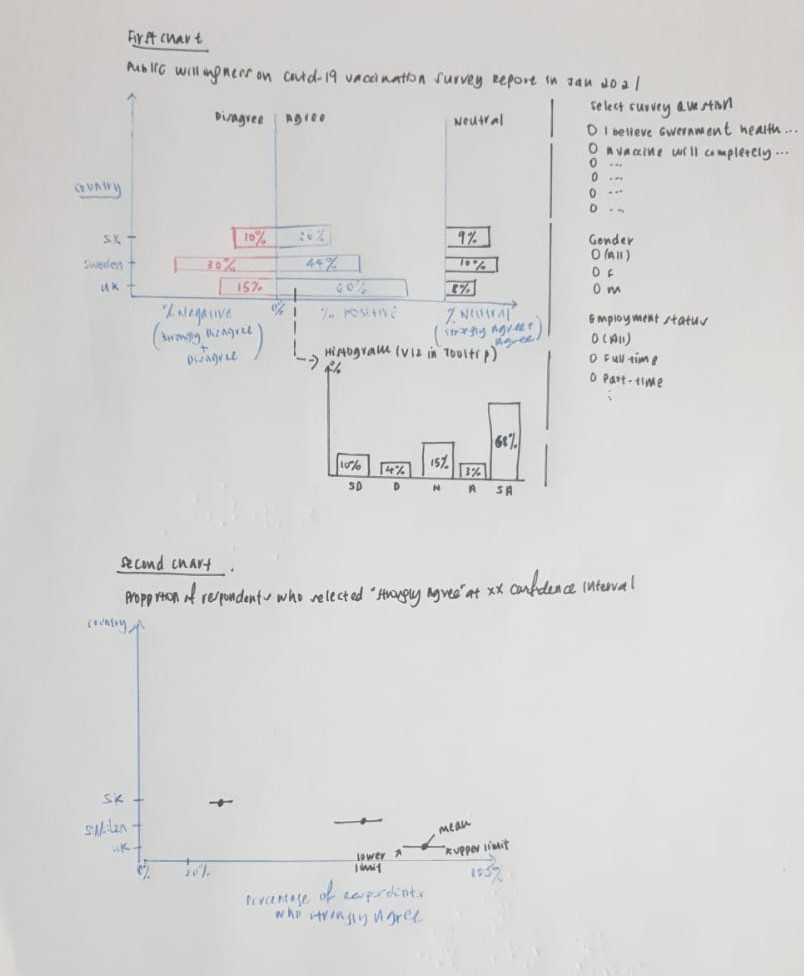{width=70%}

**In terms of Clarity:**

**For the First Chart**

1. A diverging stacked bar is created with the use of two contrasting colour to help user mentally group each half of the diverging stacked bar. Also, to include data labels for all data points.

  The positive and negative percentages are presented using a           synchronized dual axis chart. The neutrals are a separate chart       that is placed next to this dual axis chart.

Note: (i) "Strongly Disagree" and "Disagree" categories are combined   to obtain Percentage Negative.
(ii) "Strongly Agree" and "Agree" categories are combined to obtain    Percentage Positive.

2. Subsequently, a histogram bar chart is created to show the breakdown of responses for all point values on a Likert scale (“1-Strongly agree”, “2-Agree”,"3-Neutral”,"4-Disagree”,"5-Strongly disagree”) when user hovers over the stacked bar.

3. In order to build a dashboard that is interactive, parameter actions such as filters are used. For instance, user can select the survey questions using a parameter control to change the type of question. (i.e. Vac_1 is renamed to “If a Covid-19 vaccine were made available to me this week, I would definitely get it”.) For the purpose of further analysis, data collected from vac2_1, vac2_2, vac2_3, vac2_6 and vac3 are used.

**For the Second Chart**

1. In order not to mislead user into thinking that they can conclude more than the data allows, the results are presented with confidence intervals (i.e. at 90%/95%/99% confidence interval).

2. In order to build a dashboard that is interactive, parameter actions such as filters are used. For instance, user can select the date using a parameter control to change the Month of Year (i.e. January 2021).

**In terms of Asethetics:**

1. All Data points are consistently labelled in percentage in 0 decimal place, Chart title is included, and Axis title are properly labelled for better visualization of data.

2. Data source is clearly stated in the chart. Link as follows: https://github.com/YouGov-Data/covid-19-tracker/tree/master/data.

3. For better visualisation of the histogram bar chart, sequential colour scheme is applied. Recolour each segment of the stack from darkest to lightest shades of one colour to differentiate Positive sentiment, Neutral and Negative sentiment.

#  3.0 Using Tableau, design the proposed data visualization

Data Visualization can be found in Tableau Public Server:     https://public.tableau.com/profile/elaine3214#!/vizhome/Dataviz2_16136800084340/Dashboard1?publish=yes

#  4.0 Provide step-by-step description on how the data visualization was prepared

## Data Sources
Data Sources are extracted from https://github.com/YouGov-Data/covid-19-tracker/tree/master/data.

## Data Preparation

**For CSV files:**

1.	Unzip the zip files of Australia, Denmark, France, Germany, Italy, Norway, Singapore, Sweden and United Kingdom which was downloaded from Imperial College London YouGov Covid 19 Behaviour Tracker Data Hub hosted at Github. Save all 14 CSV files (comprised of Australia, Canada, Denmark, Finland, France, Germany, Italy, Japan, Netherlands, Norway, Singapore, South Korea, Sweden and United Kingdom) in a folder.

2. There were multiple columns of field name “employment_status” for Denmark, Finland, Norway and Sweden CSV files.

3. The below formula was used to combine data from multiple columns into one column to reflect the correct Employment Status for Norway's CSV files. Apply similar formula for Denmark, Finland, and Sweden CSV files.

**Formula**: IF(MATCH("Yes",CA2:CG2,0)=1,"Full time employment",IF(MATCH("Yes",CA2:CG2,0)=2,"Part time employment",IF(MATCH("Yes",CA2:CG2,0)=3,"Full time student",IF(MATCH("Yes",CA2:CG2,0)=4,"Retired",IF(MATCH("Yes",CA2:CG2,0)=5,"Unemployed",IF(MATCH("Yes",CA2:CG2,0)=6,"Not working",IF(MATCH("Yes",CA2:CG2,0)=7,"Other",0)))))))

Rename CSV files to "Denmark_cleaned", "Finland_cleaned", "Norway_cleaned" and "Sweden_cleaned".

4. Next, remove the column field name “household_children_resp” for Australia's CSV file as there are no values and there is already a similar column field name “household_children” with valid values. 

**For Tableau:**

1. Go to File and open the folder where all 14 CSV files are kept and double click on any one of the CSV files. All the CSV files in the folder will be automatically be listed in Tableau.

2. Next, manually union distinct tables. On the Data Source page, double click on **New Union** to set up the union. Select all tables to union in the left pane and then drag them directly below the first table. 

{width=70%}

3. Click Apply and Ok to union.

**Manage Metadata**

1. To hide multiple columns as not relevant for analysis by clicking on the drop-down arrow next to a column name and then select Hide. Hence, retaining the relevant columns as shown in the screenshot below. To rename column for better visualization: Double-click Table Name column and rename to "Country" for the last field name.

{width=70%}

**Pivot**

1. On the Data Source page, select columns on vac_1,vac2_1,vac2_2,vac2_3,vac2_6 and vac_3. Right-click and select **Pivot**. Rename the new pivot fields to **"Survey Answer"** and **"Survey Question"**.

{width=70%}

## Tableau Works

1. **Create an Extract**: After setting up the data source on the Data Source page, in the upper-right corner, select **Extract** to include all data.

{width=70%}

2. **Edit Alias**: Click on the worksheet. In the Data pane, right-click on Country and select Aliases. In the Edit Aliases dialog box, amend the Value (Alias) to the respective country names. 

{width=70%}

In the Data pane, right-click on **"Survey Answer"**. In the Edit Aliases dialog box, amend the Value (Alias) to the following responses ranges from 1="Strongly agree”, 2="Agree”, 3="Neutral”, 4="Disagree” and 5="Strongly disagree”. 

{width=70%}

In the Data pane, right-click on **"Survey Question"** and select Aliases. In the Edit Aliases dialog box, amend the Value (Alias) to the following responses ranges. 

{width=70%}

3. **Create Calculated Field**: Select **Analysis** and click on **Create Calculated Field**.

In the Calculation Editor that opens, give the calculated field a name and enter a formula or value. When finished, click Ok.

i. Calculated field is called **"Score"**. It is to extract integer responses from the survey. 

{width=70%}

ii. Calculated field is called **"Number of Records"** and enter a value **1**.

{width=70%}

iii. Calculated field is called **"Percentage Positive"** and is defined as:

{width=70%}

(iv) Calculated field is called **"Percentage Negative"** and is defined as:

{width=70%}

(v) Calculated field is called **"Percentage Neutral"** and is defined as:

{width=70%}

4. **Insert Variables**: Drag **[Percentage Positive]**, **[Percentage Negative]** and **[Percentage Neutral]** to the Columns shelf and Drag **[Country]** to the Rows shelf.

{width=70%}

5. **Format**: Format the x-axis to fixed at -1 to 0 for **[Percentage Negative]** and x-axis to fixed at 0 to 1 for **[Percentage Positive]** and **[Percentage Neutral]**. Format the axis scale to display percentage in whole number.

{width=70%}

{width=70%}

{width=70%}

6. **Create views in Tooltips**: When a user hovers over a mark, the tooltip will display relevant details (For this case, to display bar charts to show all levels of sentiment for positive and negative) from another visualization.

i. Create a visualization in a target worksheet view to serve as the Visualization in Tooltip. Rename the **Worksheet as ‘Tooltip’**.

ii. Drag **[Survey Answer]** to the Columns shelf and **[Number of Records]** to the Rows shelf. Right-click on **[Number of Records]** and select **Percent of Total** under Quick Table Calculation.

{width=70%}

iii. On the Marks card, drag **[Survey Answer]** onto **Colour** and edit colours to select contrasting colours.

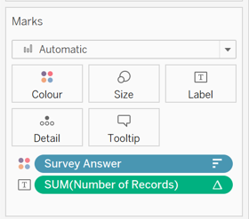{width=70%}
{width=70%}

iv. Format to show mark labels on all bar charts by selecting **Label** on the Marks card. 

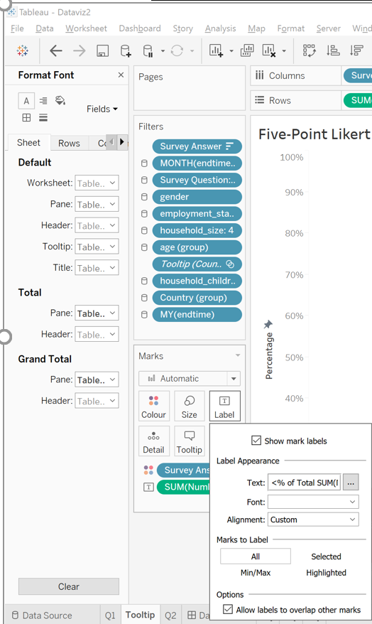{width=70%}

Final visualization of the chart is as follows:
{width=70%}

v.	In the Source Worksheet, Select **Tooltip** on the Marks card. In the Tooltip Editor, insert a reference to the Visualization in Tooltip target worksheet.

{width=70%}

vi. Final Visualization of the chart showing the breakdown of responses on a five-point Likert scale when user hovers over bar is as follows. Chart title is included and a text box is inserted to describe what is displayed in the visualization.

{width=70%}

{width=70%}

## To Display Standard errors and Confidence intervals in Tableau

**Create Confidence interval bars**:

1. **Create the necessary Calculated Field**: Select Analysis and click **Create Calculated Field**.

2. **Create calculated field – Score-Strongly agree**: To extract the percentage of survey responses who strongly agreed to vaccination, create the calculated field **“Score-Strongly agree”** with calculation as follows:

  if[Score]=1 THEN 1    
  else 0    
  end

3. **Create calculated field – Proportion**: Create the calculated field **"Proportion"** with calculation as follows:

SUM([Score-Strongly Agree])/SUM([Number of Records])

4. **Create calculated field – Standard Error**: Create the calculated field **“Proportion_SE”** with calculation as follows:

sqrt(([Proportion]*(1-[Proportion]))/sum([Number of Records]))

5. **Create calculate field-Z Value for 90% confidence interval**: Create the calculated field **“Z_90%”** with value as follows: 1.64485

6. **Create calculated field – Z Value for 95% confidence interval**: Create the calculated field **“Z_95%”** with value as follows: 1.959964

7. **Create calculated field – Z Value for 99% confidence interval**: Create the calculated field **“Z_99%”** with value as follows: 2.575829

8. **Create a parameter to select confidence interval**: In the Data pane, click the drop-down arrow in the upper right corner and select **Create Parameter**. Select the Data type as "String" and Allowable values as "List". Edit the List of Values as follows:

{width=70%}

9. **Create calculated field to select vary confidence interval**:

{width=70%}

10. **Create upper and lower limit for the confidence interval**: 

Create the calculated field **“Upper Bound of Confidence Interval”** with calculation as follows: [Proportion]+[CI]*[Proportion_SE]

Create the calculated field **“Lower Bound of Confidence Interval”** with calculation as follows: [Proportion]-[CI]*[Proportion_SE]

11. **Insert Variables**

i. Drag **[Measure Values]** to the Columns shelf and Drag **[Country]** to the Rows shelf.

{width=70%}

ii. On the **Marks card**, select **Line** from the Dropdown.

{width=70%}

iii. Remove unnecessary Measure Values and the following are retained:

{width=70%}

iv. Drag **[Measure Names]** onto **Size**, **Colour** and **Path** on the Marks card. Click **Size** on the Marks card and adjust the slider to the desired thickness. Click on **Colour** and select contrasting colours to match the [Measure Names].

{width=70%}

v. Drag **[Proportion]** to the Columns shelf. Right-click and check **Dual Axis**. On the axis, right-click and select **Synchronize Axis**. On the Marks card, select **Circle** from the Dropdown. Click **Size** on the Marks card and adjust the slider to the desired size.

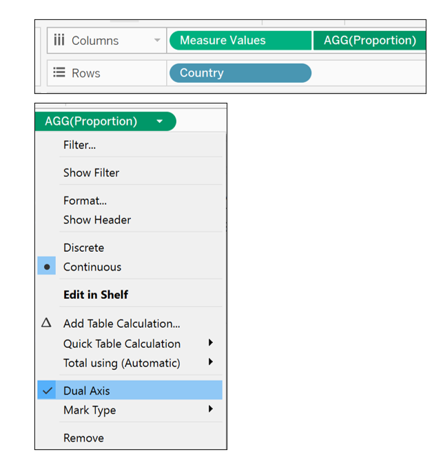{width=70%}
{width=70%}

vi. Fix the axis range to **Automatic**. Rename x-axis to **“Percentage of Respondents who Strongly Agree”**.

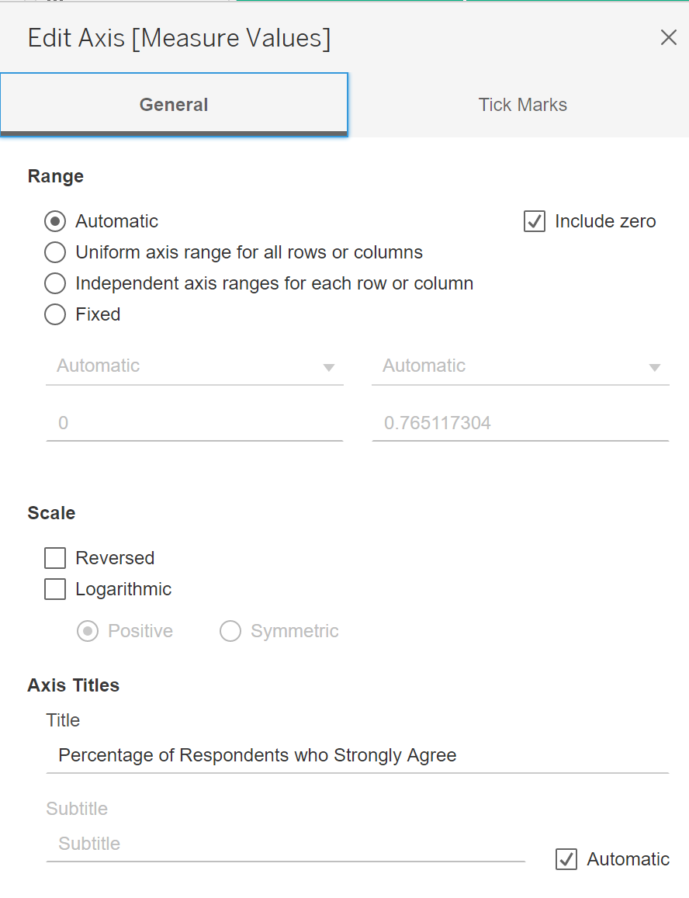{width=70%}

vii. Right-click on the **Grand Total** and Select **Column Totals to Top**.

{width=70%}

viii. On the Marks card, select **Tooltip** and edit to display the following details:

{width=70%}

viii. Edit the Title of the chart as follows: 

{width=70%}

The Final Visualization of the chart is as follows:

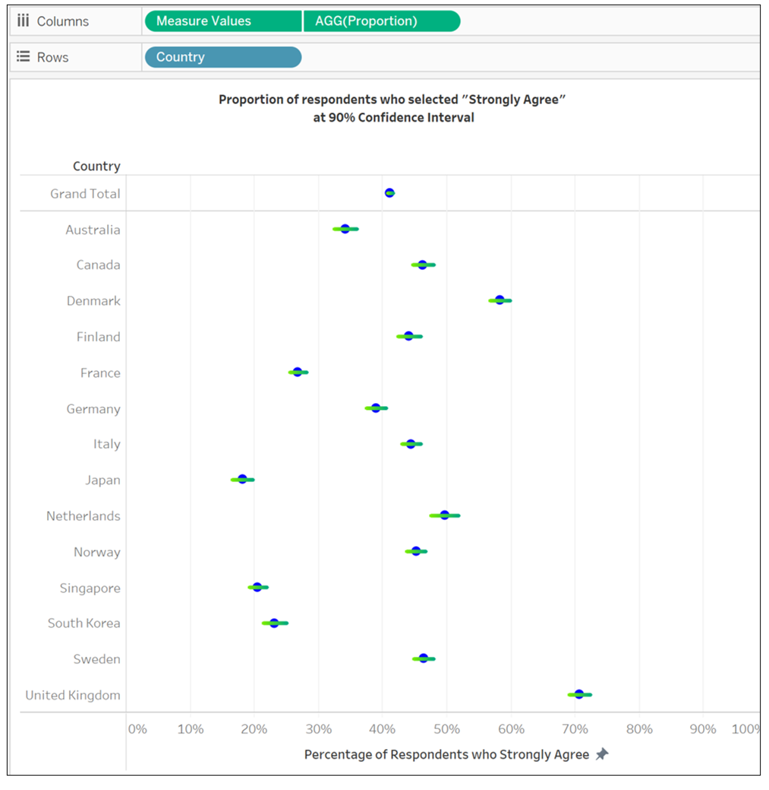{width=70%}

## Dashboard

1. **Create Dashboard**

i. At the bottom of the workbook, click the **New Dashboard** icon. From the Sheets list at the left pane, drag both worksheets to the Dashboard.

{width=80%}

ii. Edit the title of the Dashboard to **“Public willingness on Covid-19 vaccination Survey Report”**.

iii. Remove filters such as Measure Names and include the 
following fields; age (group according to 18-58 and 59-99), employment_status (rename to Employment Status), household_size (Household Size), gender (Gender),endtime (rename to Month-Year) and household_children (rename to Household Children) to filters (on the right pane) to create an interactive Dashboard.

iv. Add in data source at the bottom of the Dashboard: https://github.com/YouGov-Data/covid-19-tracker/tree/master/data.

v. Select every filter on the right pane and click on the left arrow indicating “More Options”. Select “Apply to Worksheets” and click on “All Using This Data Source”.

{width=70%}

vi. Include animations for better visualization. Under Format, select **Animations**. Enable animations by setting the **Workbook Default** to **“On”** for duration 0.30 seconds.

{width=60%}

vii. Final Visualization of the Dashboard is as follows:

{width=90%}

# 5.0 Describe three major observations revealed by the data visualisation prepared.

1.	With Covid-19 vaccines currently being rolled out across the world, countries in Europe such United Kingdom, Demark and Netherlands are most willingly to take the vaccine. Based on the survey question, **“if a Covid-19 vaccine were made available to me this week, I would definitely get it”**, 78% of the respondents from United Kingdom responded “Agree” or “Strongly Agree” based on the survey conducted in January 2021, compared to 71% in December 2020. This is supported by the fact that 16 million people across United Kingdom have now received their first dose of the vaccine according to the statistics extracted from https://coronavirus.data.gov.uk/details/vaccinations.

{width=90%}
{width=90%}

2. For Singapore, based on the survey question, **“if a Covid-19 vaccine were made available to me this week, I would definitely get it”**,  the percentage of respondents who are willingly to be vaccinated is 36% based on the survey conducted in January 2021. On the other hand, 29% of the respondents are not willing to take a Covid-19 vaccine and 35% were undecided. The percentages do not differ much significantly mainly due to public approach of wait-and-see attitude and reservations among Singaporeans toward the vaccine. However, there have been efforts done by the Government to encourage the take-up of Covid-19 vaccine such as going door-to-door to address concerns.

{width=90%}

3. Further analysis was conducted based on the number of people in household. Typically, based on the survey question conducted in January 2021, **“if a Covid-19 vaccine were made available to me this week, I would definitely get it”**,  the uncertainty in the responses who selected ‘Strongly Agree’ for household size of 5 is larger than the responses for household size of 3 as shown in the screenshots below.  The above results are based on 95% confidence level. This could be due to the different levels of mistrust of vaccine benefit and concerns of potential side effects of a Covid-19 vaccine within the family members.

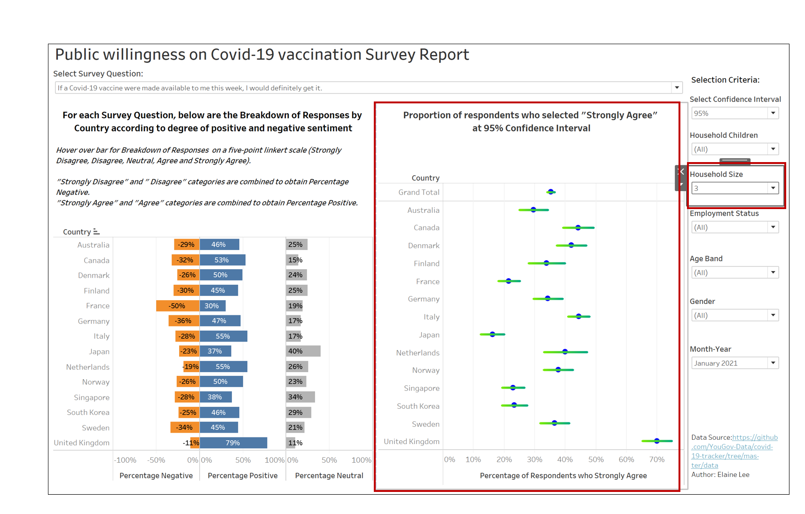{width=90%}
{width=90%}

Evident from another survey question, **"I am worried about the potential side effects of a Covid-19 vaccine”**, the uncertainty in the responses who selected ‘Strongly Agree’ for household size of 5 is also larger than the responses for household size of 3.

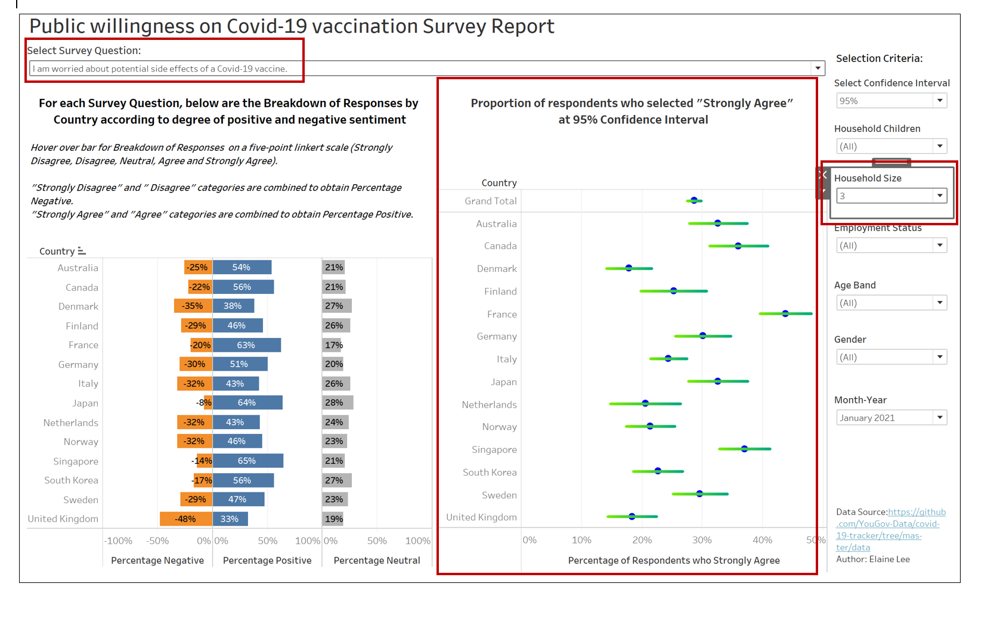{width=90%}
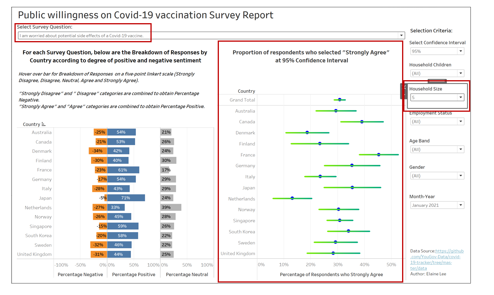{width=90%}

4. France has a long history of distrusting vaccines. It is evident from the Survey question, **"If I do not get a Covid-19 vaccine when it is available, I will regret it”** that 45% of the respondents strongly disagree or disagree with the statement. It has the highest proportion as compared to other countries in Europe. In addition, females expressed more negative sentiment than Males; 45% as compared to 38%. It could be explained because women typically have lower confidence in vaccines. It could also be explained by women being less at risk of developing severe Covid-19. Indeed, vaccine hesitancy in France is nothing new and is indeed one of the main challenges faced by the Government.

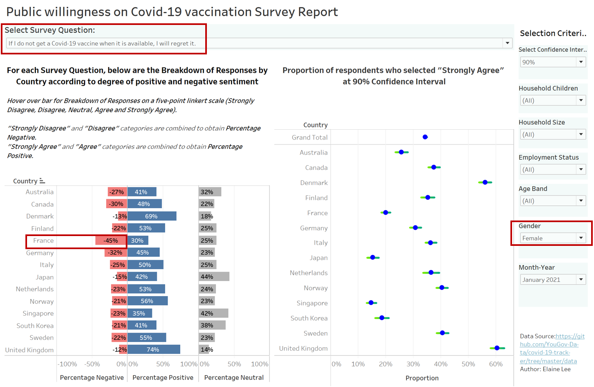{width=90%}
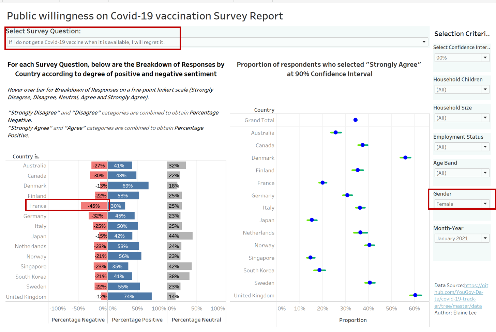{width=90%}
