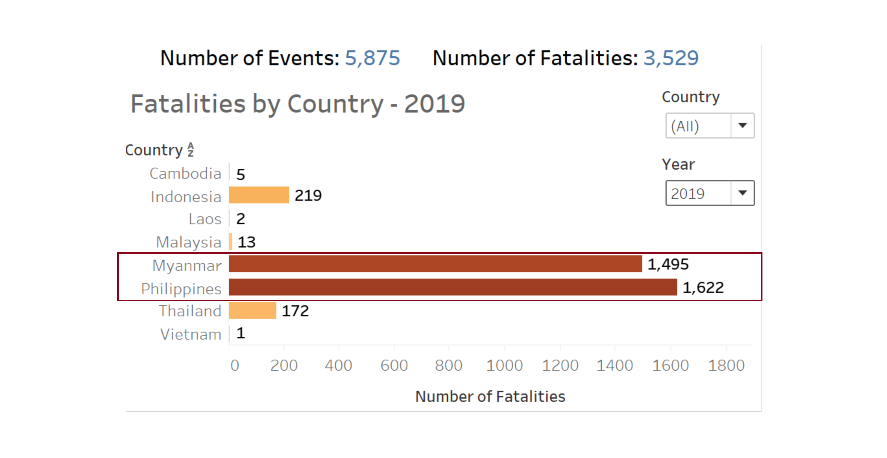

```{r setup, include=FALSE}
knitr::opts_chunk$set(echo = FALSE)
```

#  1.0 Critic the interactive data visualisation from its clarity, aesthetics and interactivity. At least two from each evaluation criterion. 


**Clarity:**

1. The first map on “Armed Conflict Location & Event in Myanmar, 2015-2020” highlights visual clusters of data using point distribution maps.  However, it presents difficulty in counting the dots to obtain actual value due to overlapping/overcrowding of data points.

2. The first map on “Armed Conflict Location & Event in Myanmar, 2015-2020” does not clearly show the country names in the data due to the opacity of the overlapping/overcrowding data points.  

3. The axis title for the x-axis for the second chart on “Armed Conflict Event by Type” is displaying as “Event Date” but the axis range format is displaying as year (i.e. 2015 to 2020) instead of date. Hence, it may create confusion for user when interpreting the data values.

4. The axis label for the y-axis for the second chart on “Armed Conflict Event by Type” is displaying as “Count of Sheet1”. There is no clear indication of what does Sheet1 represents. Hence, user is unable to infer what does y values stand for.

5. There is no indication of the total number of events reflected on the second chart “Armed Conflict Event by Type”. Hence, unable to provide user with an idea about the magnitude of every value compared to that of the totals.

**Aesthetics:**

1. Data Labels (for example, Number of armed conflicts) are not displaying for all the data points for the second chart on “Armed Conflict Event by Type”. Hence, unable to facilitate easy reading of data points.

2. The second chart on “Armed Conflict Event by Type” is displayed with different Y-axis ranges which distorts the output.

3. There is no clear indication of data source stated in both charts.

4. There is no distinctiveness between colours to differentiate the type of events for the second chart on “Armed Conflict Event by Type”.

5. Good use of colour scheme to differentiate the different type of events for the first map on “Armed Conflict Location & Event in Myanmar, 2015-2020”.

**Interactivity:**

1. The first map on spatio patterns indicates the Armed conflict location and event in Myanmar from 2015 to 2020. However, user is unable to use date dimension as filter to visualize the impact of armed conflict across different time period for individual locations.

2. For the first map on “Armed Conflict Location & Event in Myanmar, 2015-2020”, there are no explanations/annotations of “Event Id Cnty” displayed in the tooltip.

3. The filter action for the Country only allows single-select. Hence, there is no flexibility to present the filter by multiple values lists.

#  2.0 With reference to the critics above, suggest alternative data visualisation and interactive techniques to improve the current design. Support your design by describing the advantages or which part of the issue(s) your alternative design try to overcome. 

**Sketch of Proposed Design**:

{width=60%}

**In terms of Clarity:**

1. An overview dashboard (choropleth map) was developed across the entire dataset providing a more granular view of the number of events according to the year in which the event took place. Also, the map is based on statistical data that is shown through different colour ranges in which darker colour are used to indicate large number of records (i.e. number of events) and the lightest shade indicates the least number of records (i.e. number of events) that took place in the country.  In addition, the largest sub-national administrative region data layer is added to the map view.

2. Line charts were included to clearly display the trend of number of events and number of fatalities from 2010 to 2020.

3. Next, number of fatalities were highlighted in Bar charts as opposed to proportional symbol maps as it can be difficult to distinguish between different shades due to vast amount of data values.

4. Further visualization of the top 3 actors (the named actor involved in the event) responsible for the largest share of fatalities was also highlighted in the bar charts.

5. Axis label “Count of Sheet1” is not shown for all charts but is renamed to Number of Events for better inference of data values.

6. Tooltip is configured to display relevant information for visualization. For instance, latitude and longitude coordinates are removed as not relevant to user.

**In terms of Asethetics:**

1. All data points are consistently labelled as whole number in 0 decimal place, Chart title is included, and Axis title are properly labelled for better visualization of data.

2. Data source is clearly stated in the chart. Link as follows: https://acleddata.com/#/dashboard.

3. For better visualisation of the bar charts, sequential colour scheme is applied. Recolour each segment of the stack from darkest to lightest shades of one colour to differentiate the most and least number of fatalities.

4. For better visualisation of the line charts, the colour of individual line is synchronised with the legend.

**In terms of Interactivity:**

1. In order to build a dashboard that is interactive, parameter actions such as filters are used. For instance, user can visualize the number of events occurring in a country using a parameter control to change the year in which the event took place.  

2. Animation is included to allow a graphical element to be tracked throughout a transition.

#  3.0 Using Tableau, design the proposed data visualization

Data Visualization can be found in Tableau Public Server: 
https://public.tableau.com/profile/elaine3214#!/vizhome/Book1_16162677950480/Dashboard?publish=yes

#  4.0 Provide step-by-step description on how the data visualization was prepared

## Data Sources
Data Sources are extracted from https://acleddata.com/#/dashboard

## Importing Data into Tableau 

**1. CSV File**

Select **File** > **Open** and navigate to the location of the Workbook using the open dialog box. Double-click on the workbook file named **Southeast-Asia_2010-2020_Oct31.csv**.

## Steps taken for Map 

**1. Format Geographic Data**:

Assign geographic roles to fields on **[Region]**, **[Admin1]**, **[Admin2]**, **[Admin3]** and **[Location]**.

On the Data Source page, click the data type icon for **[Region]** and select Geographic Role: Country/Region.  Click the data type icon for **[Admin1]** and select Geographic Role: **State/Province**. Click on the data type icon for **[Admin2]**, **[Admin3]** and **[Location]** and select Geographic Role: **City**.

{width=70%}

**2. Rename Variables**:

Double click the name of columns; **[Admin1]**, **[Admin2]** and **[Admin3]** to rename the field to **State/Province**, **City** and **Town** respectively.

{width=70%}

**3. Create an Extract**:

After setting up the data source on the Data Source page, in the upper-right corner, select **Extract** to include all data.

{width=70%}

## For Tableau

**1. Create a Geographic Hierarchy**:

In the Data pane, click on **[Country]** and select **Hierarchy** > **Create Hierarchy**.

In the Create Hierarchy dialog box, name the hierarchy as **Map** and click Ok.


In the Data pane, drag the **[State/Province]** field to the hierarchy and place it below the **[Country]** field. Subsequently, drag the **[City]** and **[Town]** field to the hierarchy.

The hierarchy is in the following order:
i) Country,
ii) State/Province,
iii) City, and
iv) Town.

**2. Create a Map**:

In the Data pane, drag **[Country]** onto the Marks card and drag **[Longitude]** to the Columns shelf and **[Latitude]** to the Rows shelf.

{width=70%}

Create Calculated field “Number of Records” and input value as 1.

Drag **[Country]** onto Label on the Marks card. 
Drag **[Country]**, **[State/Province]** and **[Year]** onto Detail on the Marks card. Drag **[Number of Records]** onto Colour on the Marks card. 

{width=70%}

Click on **Colour** and select contrasting Red colour. Adjust the Opacity to 80%.

{width=70%}

On the Marks card, select Tooltip and edit to display the following information.Rename State/Province to Largest sub-national administrative region.


**3. Create Layered Map**:

Drop **[Country]** on the **Add a Marks Layer control** displays in the top left corner of the view. A new marks layer is added to the Marks card. Drag **[Country]** onto Colour and Label, and **[Number of Records]** onto Tooltip on the Marks card.

{width=70%}

Format to show mark labels on the map and adjust the font size accordingly:

{width=70%}

Click on **Colour** and select sequential Grey tone. Adjust the Opacity to 89%.

{width=70%}

On the Marks card, select Tooltip and edit to display the following information:

{width=70%}

Create dynamic title that changes based on year as follows:

{width=70%}

Multiple layers of geographic data to a map as follows:

{width=80%}

## Steps taken for Bar Chart

**1. Create a new Worksheet named "Fatalities by Country"**

In the Data pane, drag **[Fatalities]** to the Columns shelf and **[Country]** to the Rows shelf.

{width=70%}

Drag **[Fatalities]** onto Colour and Label, and **[Number of Records]** onto Detail on the Marks card.

{width=70%}

Click on **Colour** and select sequential Orange tone. 

{width=70%}

Format to show mark labels on the map and adjust the font size accordingly:

{width=60%}

On the Marks card, select Tooltip and edit to display the following information:

{width=70%}

Create dynamic title that changes based on year as follows:

{width=70%}

Visualization of the chart as follows:

{width=80%}

**2. Create a new Worksheet named "Top 3 Actors by Fatalities"**

Double click the name of column; **[Actor 1]** to rename the field to **[Named Actor Involved in the Event]**.

In the Data pane, drag **[Fatalities]** to the Columns shelf and **[Country]** and **[Named Actor Involved in the Event]** to the Rows shelf.

{width=70%}

Select **Analysis** and **Create Calculated Field**.

Name the calculation as **Top N** and enter the following formula, then click Ok.

{width=70%}

Place **[Top N]** on Filters and right click to select **Edit Table Calculation**.

Under **Compute Using**, select **Specific Dimensions**.

Under **Restarting Every**, select **Country**.

Under **Sort Order**, select **Specific Dimensions**.

{width=70%}

In the Filter dialog box, select the range of values for your Top N as follows, then click Ok.

{width=70%}

Visualization of the chart as follows:

{width=90%}

## Steps taken for Line Chart

**1. Create a new Worksheet named **"Trend by Event Type"**

In the Data pane, drag **[Year]** to the Columns shelf and **[Number of Records]** and **[Fatalities]** to the Rows shelf.

{width=70%}

Drag **[Event Type]** onto Colour on the Marks card and edit the Colour as follows:

{width=70%}

Create views in Tooltips to display the breakdown of number of events and number of fatalities by Country.

Create a visualization in a target worksheet view to serve as the Viz in Tooltip. Rename the worksheet as **"Tooltip1"** and **"Tooltip2"**.

**For Tooltip1**:

i)	Drag **[Country]** to the Rows shelf. 
ii)	On the Marks card, drag **[Number of Records]** onto Text.

**For Tooltip2**:

i)	Drag **[Country]** to the Rows shelf. 
ii) On the Marks card, drag **[Fatalities]** onto Text.

In the source worksheet, click **Tooltip** in the **Marks card**. In the Tooltip Editor, insert a reference to the Viz in Tooltip target worksheet as follows:

{width=70%}

{width=70%}

Final visualization showing the breakdown of number of events and number of fatalities by Country when user hovers over bar as follows:

{width=80%}

## Dashboard

**Create Dashboard**

1. At the bottom of the workbook, click the New Dashboard icon:

{width=70%}

2. From the Sheets list at the left pane, drag all relevant worksheets to the dashboard.

3. Edit the title of the Dashboard to **“Armed Conflicts in South-east Asia”**.

4. Add in data source at the top of the Dashboard: https://acleddata.com/#/dashboard.

5. Select every filter on the right pane and click on the left arrow indicating “More Options”. Select “Apply to Worksheets” and click on “All Using This Data Source”.

{width=70%}

6. Add animations for better visualization. Under Format, select **Animations**. Enable animations by setting the Workbook Default to “On” for duration 0.30 seconds.

{width=60%}

7. Edit the Chart Title to reflect dynamic Number of Events and Number of Fatalities based on selected filters as follows:

{width=70%}

**Upload to Tableau Public**

1. Select **Server** > **Tableau Public** > **Save to Tableau Public**.

2. Enter Tableau Public credentials in the dialog box.

3. Edit the Title of workbook to **Dataviz Makeover 3**.

4. Final Visualization of the Dashboard as follows:

{width=90%}

# 5.0 Describe five major observations revealed by the data visualisation prepared

1. Philippines is the country with the most number of conflict events reported from 2010 to 2020. As evident from the geographic map, darker colour is used to indicate large number of records (i.e. number of events) and the lightest shade indicates the least number of records (i.e. number of events) that took place in the country.  

Philippines is the country with regions covered in darker Red as compared to other South-east Asia countries.

{width=70%}

2. The total number of fatalities decreased from 2019 to 2020; from 3,529 in 2019 to 2,046 in 2020. However, countries such as Myanmar and Philippines recorded the highest fatalities in 2019 and 2020. Myanmar recorded 642 fatalities in 2020, down from 1,495 fatalities in 2019 while Philippines recorded 1,205 fatalities in 2020, down from 1,622 fatalities in 2019.

{width=70%}

{width=70%}

3. Most forms of political violence are on the rise. In particular, the number of protests violence increased by 10% in 2019 to 2,224 in 2020. Thailand is the only country that recorded the highest increment of the number of protests violence (from 164 in 2019 to 679 in 2020). 

{width=100%}

{width=100%}

4. Heightened number of recorded conflict events in Philippines in 2016. 

Philippines recorded 2,406 conflict events in 2016 (as opposed to 0 in 2015). This is mainly due to the declared of "War on Drugs" on 1 July 2016 by President Duterte. As per research, Duterte’s drug war has resulted in violence against civilians increasing from around 50 recorded events to nearly 300 from June to August 2016, as government officials and anti-drug ‘vigilantes’ targeted suspected drug users nationwide.

{width=70%}

{width=70%}

5. Of the Top three actors responsible for the largest share of civilian targeting in 2020, unidentified armed group remain the top threat to civilians. In countries like Philippines, the total number of fatalities resulted from unidentified armed group is 199 in 2020. FOllowed by Myanmar where the total number of fatalities resulted from unidentified armed group is 122 in 2020.

{width=200%}
