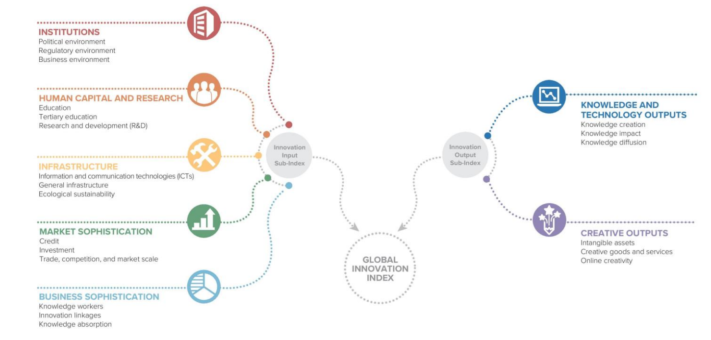

```{r setup, include=FALSE}
knitr::opts_chunk$set(echo = TRUE)
```

## 1.0 Introduction

The Global Innovation Index (GII) 2020 analyzes key global innovation trends and presents a ranking of the innovation performance of 131 economies around the world.

With the Covid-19 pandemic, the question of “Who Will Finance Innovation?”, the theme of this year’s GII, is critical in solving the seemingly insuperable challenges ahead of us.

Framework of the GII 2020:


In this project, we aim to analyse and identify patterns regarding the GII during Covid-19 pandemic.  We intend to draw conclusions from the data and generate visualization of the data for the respective countries or regions especially in Singapore.

For the scope of our project, our approaches include developing a R-Shiny application for an interactive (I) Exploratory Data Analysis which includes a Choropleth Map, Bubble Plot, Radar Chart and Time-Series Analysis and (II) Statistical Analysis which includes Box Plot, Correlation Analysis, Hierarchical Clustering, Scatter Plot and Violin Plot.

I will be covering the portion on Exploratory Data Analysis and my other teammate will cover the portion on Statistical Analysis.

## 2.0 Visual Analytics Techniques
i. **Choropleth Map**: It is the clearest visualization to identify innovation score patterns by geographic locations. The use of colours in geographical visualization is particularly useful to distinguish the most innovation countries from the least innovation countries. The darker the colour, the highest is the innovation score. Countries in grey do not have innovation data. 
 
ii. **Radar Chart**: Allow to compare the seven variables (Institutions, Human Capital and research, Infrastructure, Market Sophistication, Business Sophistication, Knowledge and technology outputs and Creative outputs) for Singapore and Switzerland (ranked first in the GII). 

iii. **Time Series using Line Graph**: A time-series visualization is crucial to view innovation trends of countries between the years of 2015 to 2020. Therefore, the line graph was the best way to present such data clearly.

iv. **Bubble Plot**: It is the clearest measure to show the relationship between innovation inputs (Institutions, Human Capital and research, Infrastructure, Market Sophistication, Business Sophistication) and innovation outputs (Knowledge and technology outputs, and Creative outputs).

## 3.0 Interactivity
i. Using leaflet R Package to build interactive map. When user hovers over a country area on the map, tooltip will display the country name and innovation score.
ii. Using plotly R Package to build interactive Radar Chart, Bubble Plot and Time Series Graph. The main features include filters which allows users to select the countries they are interested in making comparisons with. 

## 4.0 Step-by-Step Data Visualization

### 4.1 Install and Load R Packages
Import relevant packages into R. The R packages will be used to read the data and plot the visualization.

```{r}
packages = c('tidyverse', 'sf', 'tmap', 'countrycode', 'plotly', 'reshape2', 'leaflet' )
for (p in packages){
  if(!require(p, character.only = T)){
    install.packages(p)
  }
  library(p, character.only = T)
}
```
### 4.2 Load the Dataset
The raw dataset is obtained from https://www.globalinnovationindex.org/analysis-indicator and was cleaned for visualisation and analysis by my teammate, Lance Teo. Data cleaning steps can be found in his [article post](https://lance-teo.netlify.app/posts/2021-04-10-dataviz-assignment) on GII statistical analysis.

The CSV file of the dataset is loaded into the variable df using the function read_csv.

```{r}
gii_df_wide_score<-read_csv("data/gii_dataset_2015-2020_wide_score.csv")
```
### 4.3 Data Wrangling
In order to convert the data from a raw form into predefined data structures for making it more suitable for analysis, below are the pre-processing methods that encapsulate the entire process.

### Import Shapefile
Shapefile encode points,lines, and polygons in geographic space. Shapefile appears with a .shp extension.
These shape files can be obtained from [Thematic Mapping](https://thematicmapping.org/downloads/world_borders.php).

```{r}
shp <- st_read(dsn = "data/shape_files",
                layer = "TM_WORLD_BORDERS-0.3")
```

### Convert Country Codes

In order to know which region each country belongs to, we need to map each country to its region by using countrycode (package in R). The Countrycode function can convert to and from several different country coding schemes.

```{r warning=FALSE}
gii_df_wide_score <- gii_df_wide_score %>%
  mutate(iso3 = countrycode(Country, origin = 'country.name.en', destination = 'iso3c')) %>%
  mutate(region = countrycode(Country, origin = 'country.name.en', destination = 'un.region.name'))
```

### Join Shape File to Data
Using a left_join to join shape file to dataset using International Organisation for Standardization (“ISO”) variable, and ISO3 refers to a unique 3-character code that represents each individual country. This will create a join for all dataset for filtered year 2020.

```{r}
gii_score <- gii_df_wide_score %>%
  select(Country, Year, `GLOBAL INNOVATION INDEX`, iso3) %>%
  filter(Year == 2020)

map_choropleth <- left_join(shp, gii_score,
                              by = c("ISO3" = "iso3"))
```
## 5.0 Data Visualization Charts

### 5.1 Basic Static Choropleth Map
To create a tmap object (tm_shape()) followed by a thematic layer (tm_polygons()).
However, this choropleth map is static and does not allow users to drilldown for more information.

```{r}
tm_shape(map_choropleth)+
  tm_polygons("GLOBAL INNOVATION INDEX")
```
### Final Visualizaton of Choropleth Map
A visualization of the innovation scores is created in a world map using tmap. In order to produce an interactive map, leaflet (package in R) is used to create the final visualization. Customized leaflet choropleth map includes adding a legend with addLegend() and adding a tooltip with labelOptions to display the country name and GII Score when user hover a specific country.

```{r}
bins <- c(0, 10, 20, 30, 40, 50, 60, 70, 80, 90, 100)
pal <- colorBin("Blues", domain = map_choropleth$`GLOBAL INNOVATION INDEX`, bins = bins)

labels <- sprintf(
  "<strong>%s</strong><br/>%g",
  map_choropleth$Country, map_choropleth$`GLOBAL INNOVATION INDEX`
) %>% lapply(htmltools::HTML)

leaflet(map_choropleth) %>%
  addProviderTiles("CartoDB.Positron") %>%
addPolygons(
  fillColor = ~pal(map_choropleth$`GLOBAL INNOVATION INDEX`),
  weight = 1,
  opacity = 0.7,
  color = "white",
  dashArray = "3",
  fillOpacity = 0.7,
  highlight = highlightOptions(
    weight = 2,
    color = "#666",
    dashArray = "",
    fillOpacity = 0.7,
    bringToFront = TRUE),
  label = labels,
  labelOptions = labelOptions(
    style = list("font-weight" = "normal", padding = "3px 8px"),
    textsize = "15px",
    direction = "auto")) %>%
  addLegend(pal = pal, values = ~map_choropleth$`GLOBAL INNOVATION INDEX`, opacity = 0.7, title = 'GII Score',
                position = "bottomright")
```

### 5.2 Radar Chart
A visualization of a two-dimensional chart of quantitative variables represented on axes originating from the center is created using Plotly. Each data point is determined by the distance from the pole (the radical coordinate) and the angle from the fixed direction (the angular coordinate). 

We will be using the radar chart for comparison between seven variables across two countries. For this assisgnment, we are only comparing between Singapore and Switzerland in year 2020.

```{r}
cty_1 = "Singapore"
cty_2 = "Switzerland"

radar1 <- gii_df_wide_score %>%
  filter(Country == cty_1) %>%
  filter(Year == 2020) %>%
  select(c("Country",
           "1. Institutions", 
           "2. Human capital and research",
           "3. Infrastructure",
           "4. Market sophistication",
           "5. Business sophistication",
           "6. Knowledge and technology outputs",
           "7. Creative outputs")) %>%
  replace(is.na(.), 0) %>%
  pivot_longer(cols = c("1. Institutions", 
           "2. Human capital and research",
           "3. Infrastructure",
           "4. Market sophistication",
           "5. Business sophistication",
           "6. Knowledge and technology outputs",
           "7. Creative outputs"), names_to = "Indicator", values_to = "Score" )

radar2 <- gii_df_wide_score %>%
  filter(Country == cty_2) %>%
  filter(Year == 2020) %>%
  select(c("Country",
           "1. Institutions", 
           "2. Human capital and research",
           "3. Infrastructure",
           "4. Market sophistication",
           "5. Business sophistication",
           "6. Knowledge and technology outputs",
           "7. Creative outputs")) %>%
  replace(is.na(.), 0) %>%
  pivot_longer(cols = c("1. Institutions", 
           "2. Human capital and research",
           "3. Infrastructure",
           "4. Market sophistication",
           "5. Business sophistication",
           "6. Knowledge and technology outputs",
           "7. Creative outputs"), names_to = "Indicator", values_to = "Score" )

fig <- plot_ly(
    type = 'scatterpolar',
    fill = 'toself'
  ) 

fig <- fig %>%
  add_trace(
    data = radar1,
    r = radar1$Score,
    theta = radar1$Indicator,
    name = radar1$Country
  )

fig <- fig %>%
  add_trace(
    data = radar2,
    r = radar2$Score,
    theta = radar2$Indicator,
    name = radar2$Country
  )

fig <- fig %>%
  layout(
    polar = list(
      radialaxis = list(
        visible = T,
        range = c(0,100)
      )
    ),
    showlegend = T
  )

fig
```

### 5.3 Time Series using Line Graph
Displaying the time-series data of innovation scores ranking of all countries from 2015 to 2020.
A line chart is created to show the changes of the GII across the years. X-axis: Year and Y-axis: GII.
For this assignment, we are displaying the time-series data for countries like Australia, Singapore and Switzerland.

```{r}
ts_df <- gii_df_wide_score %>%
  filter(Country %in% c('Singapore' ,'Australia', 'Switzerland')) %>%
  select(Country, Year, `GLOBAL INNOVATION INDEX`)

p <- ggplot(ts_df, aes(x = Year, y = `GLOBAL INNOVATION INDEX`, colour = Country)) +
  geom_line() +
  geom_point() +
  facet_grid(cols = vars(Country)) +
  theme(legend.position='none')

fig <- ggplotly(p)

fig
```

### 5.4 Bubble Plot

**Data Wrangling for Bubble Plot**

```{r}
bp_data <- gii_df_wide_score %>%
  filter(Year == 2020)

var1 = bp_data$`2. Human capital and research`
var2 = bp_data$`1. Institutions`
```

For a start, we create a static Bubble Plot for visualisation. Since Bubble Plot is not interactive, user is unable to hover a circle to obtain information or details about it.

```{r}
ggplot(bp_data, aes(x=var1, y=var2, size = `GLOBAL INNOVATION INDEX`)) +
    geom_point(alpha=0.7)
```

In order to turn the Bubble Plot interactive, ggplotly() function of the plotly package is used.

We graphed bubble plots of innovation inputs and outputs contributing to the GII. The dots are coloured accordingly to country and GII score is represented through the size of the circles..

```{r}


fig <- plot_ly(bp_data, 
               x = var1, 
               y = var2, 
               text = ~paste(bp_data$Country,"<br>Human capital and research: ", var1, '<br>Institutions:', var2), 
               type = 'scatter', 
               mode = 'markers',
               marker = list(symbol = 'circle',
                             sizemode = 'diameter',
                             line = list(width = 2, color = 'white'),
                             size = bp_data$`GLOBAL INNOVATION INDEX`, opacity = 0.5),
               color = bp_data$`region`,
               colors = "Set1")
fig <- fig %>% layout(title = 'Human capital and research VS Institutions, 2020',
         xaxis = list(title = 'Human capital and research', showgrid = F),
         yaxis = list(title = 'Institutions', showgrid = F),
         paper_bgcolor = 'rgb(243, 243, 243)',
         plot_bgcolor = 'rgb(243, 243, 243)')

fig
```

## 6.0 Observations
i. According to the World Map, country like The United States of America have very high GII scores, whereas country in Africa (like Ethiopia) have very low GII scores. This is largely due to the socioeconomic challenges in the different countries. 
ii. Referencing to the Radar Chart, Singapore has relative high scores in all seven of the innovation inputs and outputs, as compared to Switzerland (ranked first in the GII).

## 7.0 Proposed Visualization in Dashboard


## 8.0 References
Global Innovation Index: https://www.globalinnovationindex.org/Home
